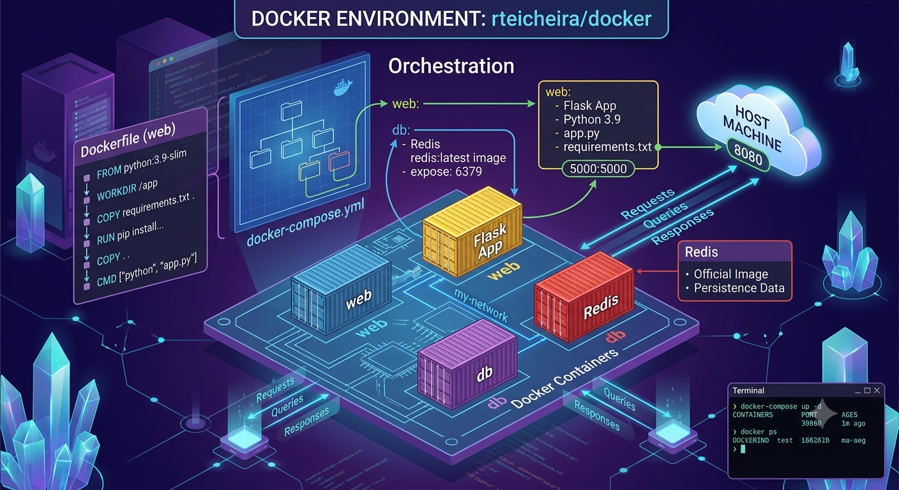

# Russ's Docker compose file collection

Just a collection of Docker Compose files and their associated README files I have used/created as I learn, develop and use the Docker environment.

## Containers

| Directory | Description |
| -- | -- |
| [ConvertX](convertx/) | File format converter supporting a wide range of document, image, audio, and video formats. |
| [Datetime](datetime/) | Simple self-hosted app that displays the current date and time. |
| [Diun](diun/) | Docker Image Update Notifier — monitors Docker images and sends alerts when updates are available. |
| [FreshRSS](freshrss/) | Self-hosted RSS feed aggregator and reader. |
| [HomeBox](homebox/) | Home inventory management system for tracking household items. |
| [Homepage](homepage/) | Customizable personal dashboard and start page with widget integrations. |
| [HomeTube](hometube/) | Self-hosted YouTube front-end for managing and watching saved videos. |
| [IT - Tools](ittools/) | Collection of handy IT utility tools for developers and sysadmins. |
| [Karakeep](karakeep/) | Self-hosted bookmark and read-it-later manager. |
| [lastGLANCE](lastglance/) | Self-hosted "last done" tracker for logging when you last did recurring tasks. |
| [nebula-sync](nebula-sync/) | Syncs Pi-hole configurations across multiple instances for consistent configuration, redundancy and ad blocking. |
| [Nginx Proxy Manager (NPM) / Tinyauth](nginx-proxy-manager/) | Reverse proxy with SSL/TLS certificate management (NPM), paired with Tinyauth for authentication. |
| [OmniTools](omnitools/) | Collection of everyday online utility tools, self-hosted. |
| [Paperless-ngx](paperless-ngx/) | Document management system for scanning, indexing, and searching physical documents. |
| [Portainer](portainer/) | Web-based Docker management UI for monitoring and managing containers. |
| [RustDesk](rustdesk/) | Self-hosted remote desktop solution, an open-source alternative to TeamViewer. |
| [Slash](slash/) | Self-hosted bookmark and shortlink manager. |
| [tools](tools/) | Combined stack running ConvertX, Datetime.app, IT-Tools, and OmniTools together. |
| [Transmission](transmission/) | Self-hosted BitTorrent client with a web interface. |
| [Uptime Kuma](uptime-kuma/) | Self-hosted uptime and service monitoring tool with status page support. |
| [WireGuard Easy (wg-easy)](wg-easy/) | WireGuard VPN server with an easy-to-use web UI for managing peers. |
| [Wiki.js](wikijs/) | Self-hosted wiki platform for creating and organizing documentation. |

## Not in use

The containers below are archived - no longer in active use or no longer being supported by the developer.

| Directory | Description |
| -- | -- |
| [Firefly_iii](firefly_iii/) | *I am no longer using this container. **Under active development and support.*** Personal finance manager for tracking income, expenses, and budgets. |
| [Pi-hole](pihole/) | *I am no longer using this container. **Under active development and support.*** Network-wide DNS-based ad and tracker blocker. |
| [Vaultwarden](vaultwarden/) | *I have not started to use this and still am on the official Bitwarden self-hosted release. **Under active development and support.*** Lightweight self-hosted Bitwarden-compatible password manager. |
| [Watchtower](watchtower/) | *Project is no longer receiving updates or support. I have switched to [Diun](diun/) with comparable functionality.* Automatically monitors and updates running Docker containers to the latest image. |

## Disclaimer

> [!WARNING]
> *No warranty or support provided. Use at your own risk.*
> If you have issues, please visit the appropriate developer's GitHub.
