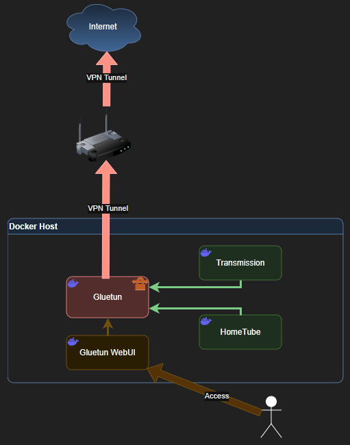

# Download Management README

This is a collect of several, privacy focused, download tools. It is currently limited to just two, but I will be working to expand. Everything is designed to go through a VPN (I use Proton as there is a free tier) for privacy or to get around any government installed blocks.

## What is...?

- [Transmission](https://github.com/transmission/transmission) is a self-hosted, cross platform, BitTorrent client.
- [HomeTube](https://github.com/EgalitarianMonkey/hometube) is a simple web UI for downloading single videos and playlists from the internet with the highest quality available and moving them to specific local locations automatically managed and integrated by media server such as Plex or Jellyfin.
- [Gluetun](https://github.com/qdm12/gluetun) is a lightweight Swiss-army-knife-like VPN client to multiple VPN service providers
- [Gluetun WebUI](https://github.com/Thiago12097/gluetun-webui) is a lightweight web interface that helps you monitor and control your Gluetun VPN client running inside Docker.
- [Autoheal](https://github.com/willfarrell/docker-autoheal) helps monitor and restart unhealthy docker containers.

> [!WARNING]
> I do not endorse the use of BitTorrent or HomeTube to download or pirate software, videos, etc. that you do not own. This project was created for the soul purpose of learning how to route network connections through another defined container. In the future I plan on splitting out the Gluetun containers to their own compose file to further my self education.

## Project source links

- [My Docker Compose](docker-compose.yaml)

| Project | Website | Container | GitHub Project |
| -- | -- | -- | -- |
| Transmission | [Website](https://transmissionbt.com/) | [Container](https://hub.docker.com/r/linuxserver/transmission) | [GitHub Project](https://github.com/transmission/transmission) |
| HomeTube | - | [Container](https://ghcr.io/egalitarianmonkey/hometube) | [GitHub Project](https://github.com/EgalitarianMonkey/hometube) |
| Gluetun | [Wiki](https://github.com/qdm12/gluetun-wiki) | [Container](https://hub.docker.com/r/qmcgaw/gluetun) | [GitHub Project](https://github.com/qdm12/gluetun) |
| Gluetun WebUI | - | [Container](https://hub.docker.com/r/scuzza/gluetun-webui) | [GitHub Project](https://github.com/Thiago12097/gluetun-webui) |
| Autoheal | [README](https://github.com/willfarrell/docker-autoheal/blob/main/README.md) | [Container](https://hub.docker.com/r/willfarrell/autoheal/) | [GitHub Project](https://github.com/willfarrell/docker-autoheal) |

## My environment variables overview

A review of the environment variables I am using in my environment. This is not an exhaustive list of all the container environment variables. Visit the respective project pages for a full list.

### Global

| Variable | Default Value | Comments |
| -- | -- | -- |
| `PUID` | unset | Used by Transmission and HomeTube. Recommended to set it to be `1000`. |
| `PGID` | unset | Used by Transmission and HomeTube. Recommended to set it to be `1000`. |
| `TZ` | unset | Used to define the container's local time. [List of TZ database time zones](https://en.wikipedia.org/wiki/List_of_tz_database_time_zones). |
| `LANG` | unset | Used to define the container's language. [IETF language tag](https://en.wikipedia.org/wiki/IETF_language_tag). |
| `LOCALPATH` | n/a | This is a defined value I use in my Docker environment to define where to store Docker Volumes. Not part of the project. |

### HomeTube
| Variable | Default Value | Comments |
| -- | -- | -- |
| `YOUTUBE_COOKIES_FILE_PATH` | `/data/config/youtube_cookies.txt` | Authentication for private videos. |
| `VIDEOS_FOLDER_DOCKER_HOST` | `/data/videos` | Where videos will be moved at the end of download. |
| `TMP_DOWNLOAD_FOLDER_DOCKER_HOST` | `/data/tmp` | Temporary download location. |
| `YOUTUBE_COOKIES_FILE_PATH_DOCKER_HOST` | `/data/cookies/youtube.txt` | YouTube cookies file path in Docker context. |

### Gluetun

| Variable | Default Value | Comments |
| -- | -- | -- |
| `VPN_SERVICE_PROVIDER` | `protonvpn` | While Proton VPN isn't the 'default', it is what I used and leaving here for the full example. |
| `VPN_TYPE` | `wireguard` | I am using the `wireguard` implementation of Proton VPN. |
| `WIREGUARD_PRIVATE_KEY` | unset | From the configuration provided by Proton VPN (or other VPN provider). Visit the [Gluetun wiki / Proton VPN](https://github.com/qdm12/gluetun-wiki/blob/main/setup/providers/protonvpn.md) for instruction on how to generate. |
| `WIREGUARD_ADDRESSES` | unset | From the configuration provided by Proton VPN (or other VPN provider). |
| `SERVER_COUNTRIES` | unset | The list of countries from the VPN provider, in the order you want to use them. |
| `FREE_ONLY` | `off` | Leave as is if you have a paid subscription or the provider doesn't offer a free tier. Change to `on` if they do and you want to use it. |
| `UPDATER_PERIOD` | `24h` | How often the VPN server list should be updated. |
| `PORT_FORWARD_ONLY` | `off` | Filter only port-forwarding enabled (aka p2p) servers by setting it to `on`. |
| `VPN_PORT_FORWARDING` | `off` | Change to `on` to enable port forwarding. |
| `VPN_PORT_FORWARDING_UP_COMMAND` | `/bin/sh -c 'apk add transmission-remote && transmission-remote localhost -p {{PORTS}} && transmission-remote localhost -t all --reannounce'` | While this isn't a default command, this is what I have found works to update port forward with my VPN provider, based on what Transmission tells it to use. |
| `DOT` | `on` | Runs the internal Unbound server with DoT (DNS over TLS) encryption. Change to `off` to disable. |
| `GLUETUN_API_KEY` | unset | Used for API calls by services like [Homepage](https://github.com/rteicheira/docker/tree/main/homepage) and Gluetun WebUI. Set in `gluetun/config/config.toml`. See the [Gluetun wiki / Control server](https://github.com/qdm12/gluetun-wiki/blob/main/setup/advanced/control-server.md) for more information. |

### Autoheal

| Variable | Default Value | Comments |
| -- | -- | -- |
| `AUTOHEAL_CONTAINER_LABEL` | `autoheal` | Used to tell autoheal which containers to monitor. |

## Network

This is one of the few services I have that has exposed ports, as all traffic goes through the *VPN*. Web UIs and APIs are accessed through the defined ports.

| Port | Description |
| - | - |
| 3000:3000 | Used to access Gluetun WebUI. |
| 8501:8501 | Web UI for HomeTube. |
| 9091:9091 | Web UI for Transmission. |
| 8880:8000 | Control server (API) access to Gluetun. |

###

## Disclaimer

> [!WARNING]
> *No warranty or support provided. Use at your own risk.*
> If you have issues, please visit the [NPM's GitHub](https://github.com/NginxProxyManager/nginx-proxy-manager/discussions) or [Tinyauth's GitHub](https://github.com/tinyauthapp/tinyauth/discussions).
