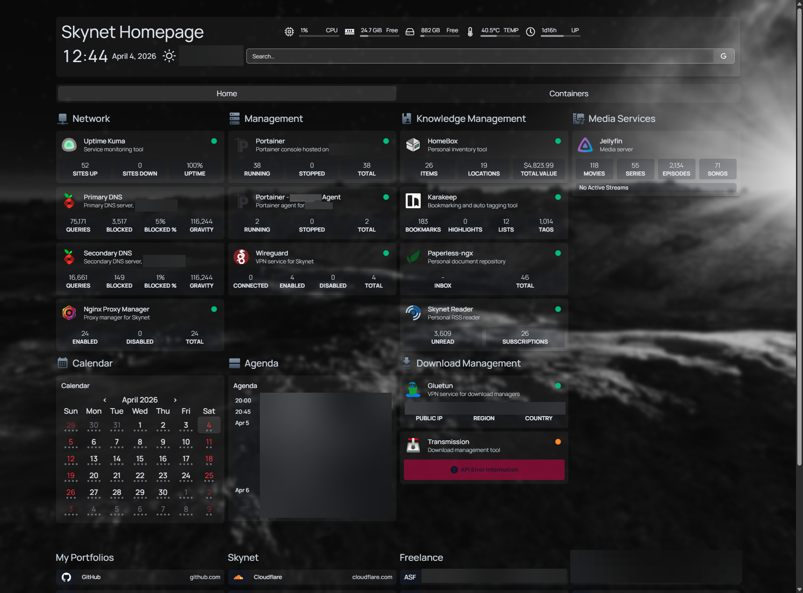
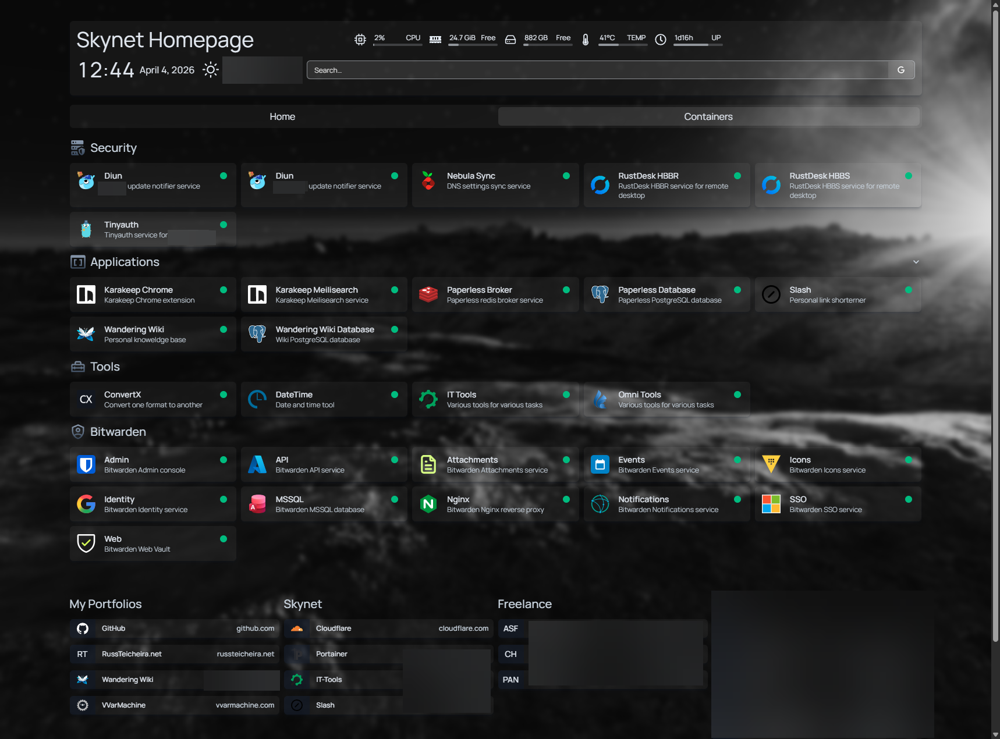

# Homepage Screenshots
With my Homepage settings, this is what it looks like. It features:
- Custom header
- Page tabs
- Column sections
- Row sections
- Google Calendar integration
- Custom background
- Sectioned bookmarks
- Box transparency

I am not the original author of this design idea. My inspiration came from [this reddit post](https://www.reddit.com/r/selfhosted/comments/1gfl70m/my_personal_dashboard_made_with_homepage_config/).

