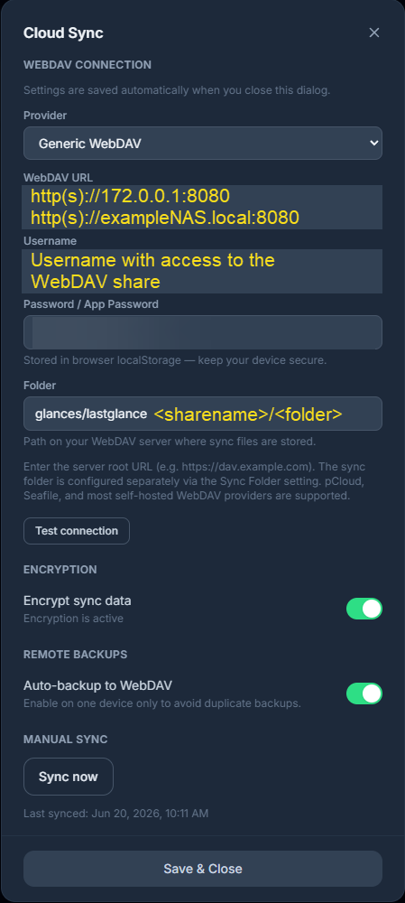

# lastGLANCE README

## Project source links

- [Website App](https://www.lastglance.app/)
- [Docker Container](https://ghcr.io/krelltunez/lastGLANCE)
- [GitHub Project](https://github.com/krelltunez/lastGLANCE)

## My environment variables overview

None

## Network

ProxNET is my main Docker network with access to each container managed through [Nginx Proxy Manager (NPM)](https://github.com/rteicheira/docker/blob/main/nginx-proxy-manager/docker-compose.yaml). This is why I have no ports defined in any of my compose files. Refer to the originals for each container's default port.

## In app setup

I did have some issues getting the automated sync to work with my generic WebDAV (I run a Terra-Master NAS with TOS6). Though it came down to a weird permission issue on the WebDAV share.

One of the roadblocks I ran into was the app was giving me false information when I used the "Test Connection" feature. It would report success, but the cloud icon on the main screen would be orange with a line through it, and no file was appearing on my NAS.

**⚠ Learning - in your browser, review your Developer Options panel for any errors - this will help diagnose any issue.**

As a reminder, the WebDAV URL should only be the server and port, no share information. See the example below.

<figure>
    
    <figcaption>As of lastGLANCE version 1.8.9</figcaption>
</figure>
